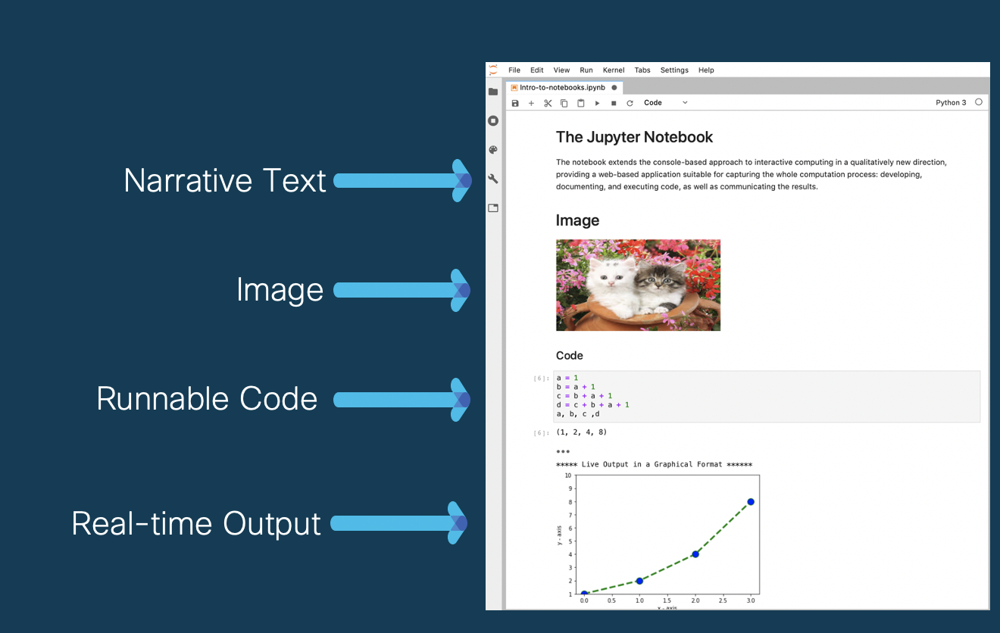
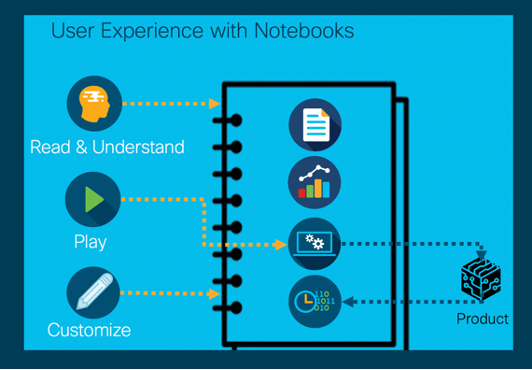

# Welcome to Cisco 8000 Emulator Notebooks!

<b>What are Cisco 8000 Emulator Notebooks?</b>

The Cisco 8000 Emulator Notebooks are live documents that combine narrative text, images, videos, runnable code, and real-time outputs. The open source software, Jupyter Lab, is used to create these notebooks. The notebook communicates with the Cisco 8000 emulator running in the background and, at the click of the play button, brings up multi-router topologies within minutes. This enables you to execute commands and configurations on the emulated routers directly from the notebook. To access these notebooks, install the [Cisco 8000 Hardware Emulator](https://www.cisco.com/c/en/us/td/docs/iosxr/cisco8000-emulator/cisco8000-hardware-emulator-installation-guide.html). For more details on accessing Notebooks, [click here](https://www.cisco.com/c/en/us/td/docs/iosxr/cisco8000-emulator/cisco8000-hardware-emulator-installation-guide.html#Cisco8000EmulatorNotebooks).

&nbsp;

<b>Why Notebooks?</b>

The pyvxr API, when invoked from within notebooks, allows you to build and manage virtual multi-router topologies within minutes.  

The pyvxr API sends your configurations to the virtual routers and retreives real-time status in the same document. You can read the content, run the configuration, view the real-time status, and even customize the configuration based on the business needs and experiment with the configuration.

<b>Benefits</b>

* Automates the creation and bringing-up of the topology on the Cisco 8000 Emulator, and saves time.
 
* Flexibility to customize topology by adding and modifying CLIs.

* Customer can test proof-of-concept, use cases, or features to existing problems.

* Leverage it as a tutorial to educate customers or partners.

* Simulate use cases and play them before actual deployments

## Getting Started

<i> 1. How to use Notebooks </i>

* [Notebook User Interface](./Getting-Started/How-to-use-Notebooks/Using_Notebooks.ipynb)

* [Interaction with Cisco 8000 Emulator](./Getting-Started/How-to-use-Notebooks/Notebook-magic.ipynb) 

* [Using Pyvxr Test Framework within Notebooks](./Getting-Started/How-to-use-Notebooks/Test-framework.ipynb)

<i> 2. Setting up a basic network </i>

* [Configure a Small Core Network](./Getting-Started/Setting-Up-Basic-Network/Small-Core/SmallCore.ipynb)

* [Configure a Label Switched Network](./Getting-Started/Setting-Up-Basic-Network/Ospf-Mpls/ospf-mpls.ipynb)

 
## Put Technology to Work

<i>Traffic Management</i>

* [QoS, to make Networks Dependable](./Put-Technology-to-Work/QoS/QoS-policies.ipynb)

* [Prioritize Delay-Sensitive Traffic Using QOS](./Put-Technology-to-Work/QoS/QoS-high-priority-flows.ipynb)

* [Filter Network Traffic Using Access Control List ](./Put-Technology-to-Work/ACL/Access-Control-List.ipynb)

* [Filter Network Traffic Using ACL Yang ](./Put-Technology-to-Work/ACL/ACLyang.ipynb)

<i>Secure Network </i>

* [Type 6 Password Authentication For BGP](./Put-Technology-to-Work/BGP-Type6-Password-Encryption/Type6-BGP-4-Routers.ipynb)

<i> Network Monitoring </i>

* [Monitor Traffic Using Encapsulated Remote Switched Port Analyzer (ERSPAN)](./Put-Technology-to-Work/ERSPAN/erspan.ipynb)

* [Stream CPU Utilization Data Using Model-driven Telemetry](./Put-Technology-to-Work/Telemetry/TelemetryDialOutCLI.ipynb)

* [Deploy YANG Data Model to Stream CPU Utilization Data Using Model-driven Telemetry](./Put-Technology-to-Work/Telemetry/TelemetryDialOutYang.ipynb)

* [Setup a Pipeline and Stream CPU Utilization Data Using Model-driven Telemetry](./Put-Technology-to-Work/Telemetry/TelemetryDialOutGPB-Yang.ipynb)

<i>APIs</i>

* [Super-charge Your Router Performance With Service-layer APIs](./Put-Technology-to-Work/ServiceLayer/ServiceLayerAPI.ipynb) 

<i> Utilities </i>

* [Python Library to Generate Real-time Traffic On Simulated Networks](./Put-Technology-to-Work/trafficUtils/README.md) 

